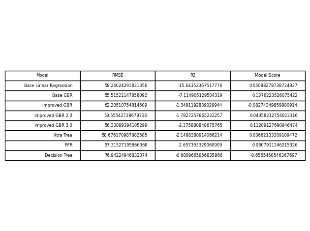
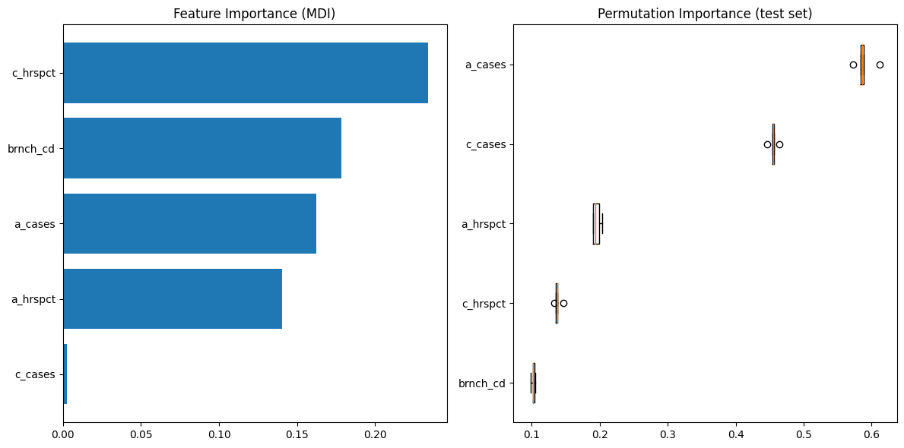
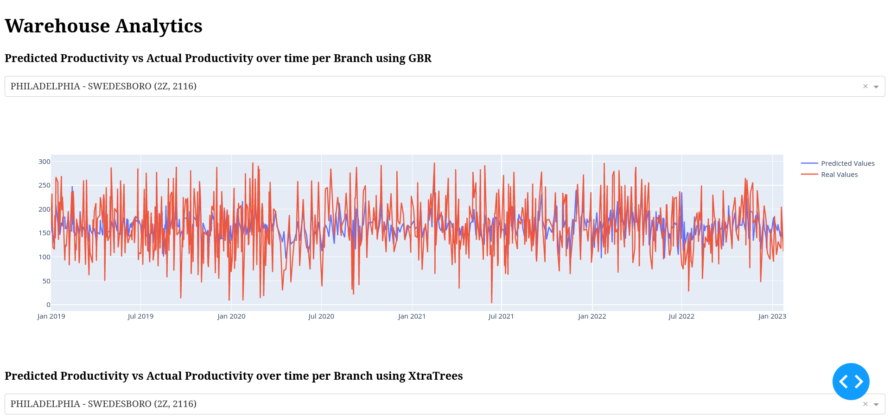

# Daily Productivity Models

## Project Description

This is a project done for a national food distributor in order to predict the daily productivity of a warehouse using various productivity metrics

## Installation and Setup

Follow these steps to get started:

1.  Clone this repository: `git clone https://github.com/rjsisto/daily-productivity-models.git`
2.  Open a terminal in the project directory: `cd daily-productivity-models`
3.  Create the virtual environment using the *run.py* script: `python run.py -c` (Mac OS/Linux) or `python run.py -w -c` (Windows)

## Usage

0.  If running on Windows, use the `-w` argument to specify your OS
1.  Launch the Jupyter Notebooks: `python run.py -j` 
2.  Navigate to the notebooks folder to view the various notebooks
3.  In order to create the models for the dashboard, run: `python run.py -m` (This processes the data and creates the models. This may take a little while.)
4.  Launch the dashboard: `python run.py -d`

## Data and Preprocessing

The three datasets are sourced from the warehouses of a major food distributor. They contain information about the warehouses and daily metrics about how many hours were worked, how many cases were processed, and others. The data is somewhat randomized in order to prevent potentially important information from being shared. The preprocessing steps include merging all three datasets, dropping unneeded variables, and creating a main productivity metric (known as cases-per-man-hours). This main productivity metric was created by dividing the number of hours worked by the number of cases processed.

## Notebooks and Analysis

-   `data_preprocess.ipynb`: Merging the datasets, dropping unneeded variables, and creating the main productivity metric.

-   `model_build.ipynb`: Creating the different models attempting to predict warehouse productivity

-   `model_eval.ipynb`: Evaluating the different models using various metrics and visualizations

## Results and Visualizations

The table below shows the different model's performance at predicting warehouse productivity (the models did perform much better with the real data, instead of the randomized data).

We can also see that the most important variables in predicting warehouse productivity is the number of hours that cohort C worked and the number of cases that cohort A worked. Each warehouse is divided up into three cohorts (A, B, and C) based upon their experience working in the warehouse.

Finally, here is a screenshot of the interactive dashboard showing the real and predicted values graphed on top of each other.

## Project Structure

-   `notebooks/`: Jupyter notebooks for data preprocessing, modeling, and analysis.
-   `notebooks/data/`: Contains the dataset files.
-   `notebooks/models/`: Folder where the models will be stored
-   `data_app/`: Contains the files for the dashboard app.

## Contact

For questions or suggestions, feel free to contact me at rjsisto1000\@gmail.com.